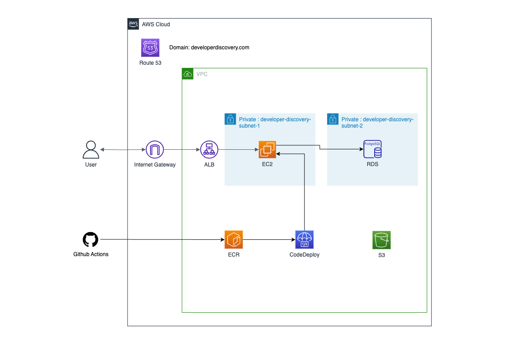

# Infra_Developer_Discovery
- Developer Discovery 관련 인프라를 관리합니다.
- 인프라 구성에 필요한 모든 것은 반드시 Terraform 을 이용하도록 작성합니다.

 

**인프라 구성**

각 서비스는 폴더 단위로 관리 되고 있습니다.

 

### 연계 프로젝트

- 백엔드 
  - [BackendDeveloperDiscovery](https://github.com/rha6780/Backend_Developer_Discovery)
  - Python, Django

- 프론트 
  - [FrontendDeveloperDiscovery](https://github.com/rha6780/Frontend_Developer_Discovery)
  - Typescript, Next.js

 

### 개발 환경

- 실행 전에 development_setup 레포에서 awscli, tfenv 를 설치해야합니다.
- `export AWS_PROFILE=ddprod` 를 통해서 실행 전 프로필 설정을 해주어야 합니다.
